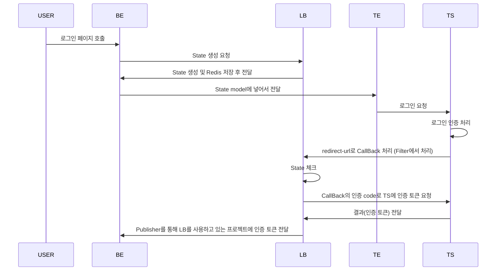

# OAuth2 인증 library

Oauth2 인증 library 개발

## 요약
Backend에서 해당 library를 통해서 Kakao, Naver 등 기업의 Login API를 간편화 하기 위함.

## 순서도

아래의 순서도를 가정으로 library를 설계

* LB : library
* BE : Backend로, LB를 쓰고 있는 프로젝트
* FE : frontend
* TS : Target Server (kakao, naver 등)
* TE : Template Engine (jsp, thymeleaf 등)

***

### 흐름

이 경우에 LB에서 Redis를 통해 State를 처리.
FE가 따로 있는 경우에는 State를 LB에서 처리하지 않음.

***

## library 요약
* library 흐름
    1. 기업의 API 서버에서 CallBack url을 호출하면 Filter를 통해서 해당 요청을 받음.
    2. 상황에 따라 State를 검증함.
    3. Filter에서 url에 따라 기관을 분류하고, 기관별 인증 로직을 수행함.
    4. 수행한 결과(인증 토큰)를 Event Publisher <--> Event Listener를 통해 전달

## library 설정 파일 - application.properties
* 서버 설정 정보
    1. host.url=localhost:8080

* 기관 설정 정보
    1. 기업 redirect-url : oauth2.{기업명}.authorize.callback.url=/naver/callback
    2. 기업 host : oauth2.{기업명}.authorize.host.url=https://nid.naver.com/oauth2.0
    3. 기업 인증 요청 url : oauth2.{기업명}.login.authorize.token.url=/token
    4. 기업 client-id : oauth2.{기업명}.clientid=UMKT4dIs6FAj23xkYaC1
    5. 기업 secret-key : oauth2.{기업명}.secretkey=fwBz2BIrLy

* redis
    1. Redis host : spring.cache.redis.host=localhost 
    2. Redis port : spring.cache.redis.port=6379
    3. Redis 사용여부 : spring.data.redis.repositories.enabled=true  - 수정 예정.

