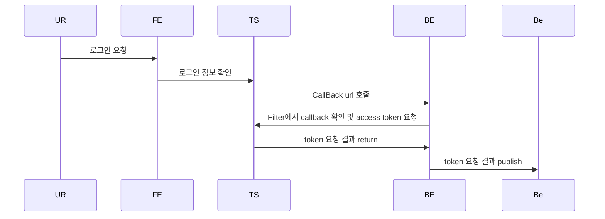
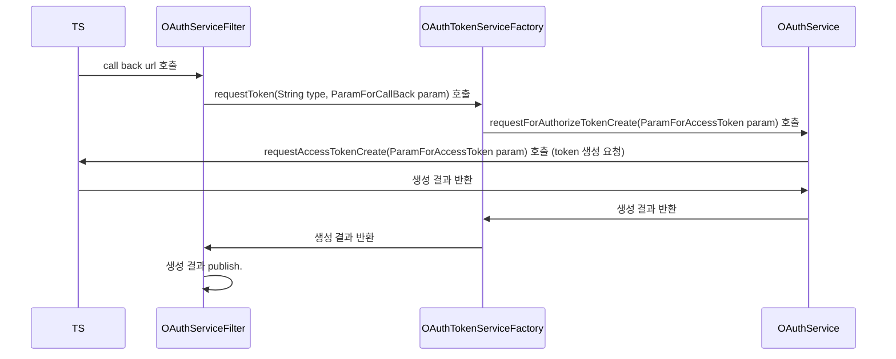

# OAuth2 인증 library

Oauth2 인증 library 개발

## 요약
Backend에서 해당 library를 통해서 Kakao, Naver 등 기업의 Login API를 간편화 하기 위함.

## 프로세스 흐름
* BE : Backend로, LB를 쓰고 있는 프로젝트
* FE : frontend
* TS : Target Server (kakao, naver 등)
* UR : User

***

***

## Spring 흐름도

***

***

### Spring 흐름도 클래스
* OAuthServiceFilter : Callback url을 받고, Access token 생성 요청을 하기 위한 필터.
* OAuthTokenServiceFactory : Access token 생성 요청을 수행하는 Service Bean 찾고, token 요청 param 생성하는 클래스.
* OAuthService : access token을 직접 요청하는 service.

## 서비스 정보 등록
* 설정 위치 : resources/config
* 형식 : *.properties
* property 입력 형식
    1. 토큰 생성 요청 url : oauth2.authorize-info.{기업}.request-token-url=https://nid.naver.com/oauth2.0/token
    2. Client_id : oauth2.authorize-info.{기업}.client-id=UMKT4dIs6FAj23xkYaC1
    3. Secret_key : oauth2.authorize-info.{기업}.secret-key=fwBz2BIrLy
    4. Redirect_url : oauth2.authorize-info.{기업}.call-back-uri=/naver/callback
    5. Redirect_url의 Host : oauth2.authorize-info.{기업}.call-back-host=http://localhost:8080
    6. Grant-Type param 정보 : oauth2.authorize-info.{기업}.grant-type=authorization_code
    7. Authorize 요청 url : oauth2.authorize-info.{기업}.authorize-url=https://nid.naver.com/oauth2.0/authorize

