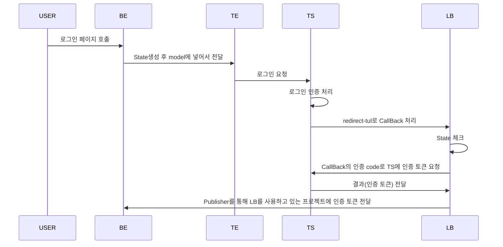

# OAuth2 인증 library
***

Oauth2 인증 library 개발

## 요약
Backend에서 해당 library를 통해서 Kakao, Naver 등 기업의 Login API를 간편화 하기 위함.

## 순서도

아래의 순서도를 가정으로 library를 설계

* LB : library
* BE : Backend로, LB를 쓰고 있는 프로젝트
* FE : frontend
* TS : Target Server (kakao, naver 등)
* TE : Template Engine (jsp, thymeleaf 등)

### 1. FE와 BE가 따로 있는 경우

### 2. WAS에 한 번에 있는 경우 

이 경우에 State는 LB의 redis를 통해 관리

## library 상세
* 기업의 로그인 API 서버에서 CallBack url을 호출하면 Filter를 통해서 해당 요청을 받음.
* Filter에서 url에 따라 기관별 인증 요청 로직을 수행함.
* 수행한 결과로 받은 결과(인증 토큰)은 Event Publisher <--> Event Listener를 통해 전달.
