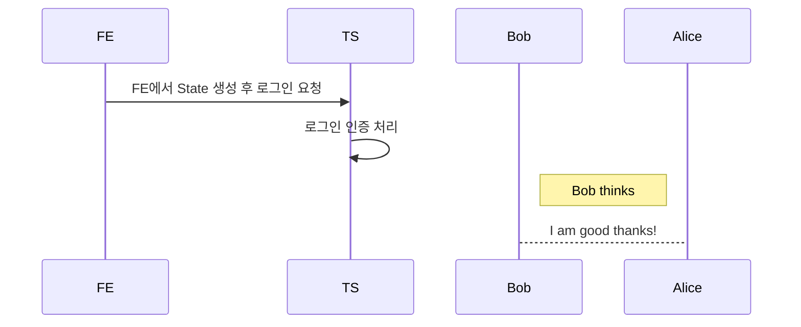

### OAuth2 인증 library
***

Oauth2 인증 libarary 개발

## 요약
Backend에서 해당 library를 통해서 Kakao, Naver 등 기업의 Login API를 간편화 하기 위함.

## 순서

* LB : library
* BE : Backend
* TS : Target Server(kakao, naver 등)


```
